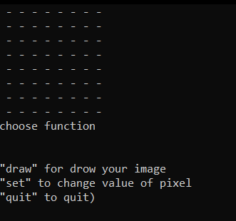
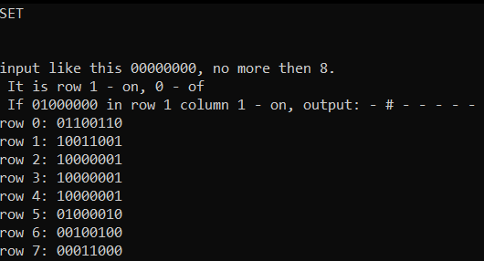
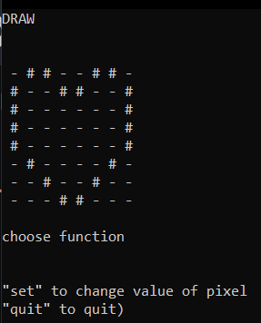

 8x8 matrix on cpp
 ---
This sourse code can halp you whan you makind your own console interface or whan you customize 8x8 matrix

---
🎬What is it
---

---
### 📲Contacts
##### __Discord: 𝔰𝔦𝔩𝔳𝔢𝔯 𝔰𝔥𝔞𝔡𝔬𝔴#5304__
